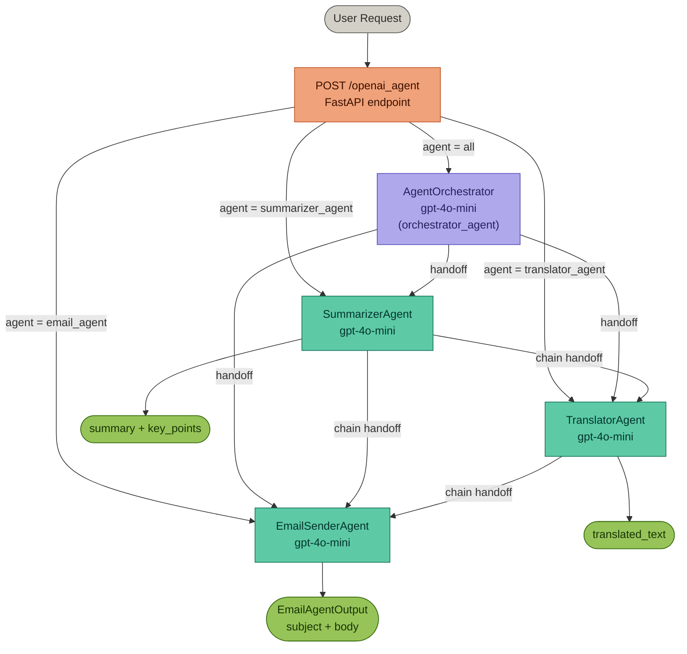

# Multi-Agent Orchestration

A **FastAPI** service built on the **OpenAI Agents SDK** that routes natural-language requests to specialised AI agents. An orchestrator agent analyses each request and hands off to the correct specialist — or chains multiple specialists together for multi-step tasks.

---

## What it does

| Capability | Agent |
|---|---|
| Draft / compose emails | `EmailSenderAgent` |
| Summarise text & extract key points | `SummarizerAgent` |
| Translate text into any language | `TranslatorAgent` |
| Auto-route all of the above | `AgentOrchestrator` |

Single requests go to one agent. Multi-step requests (e.g. "summarise this then translate it") are chained automatically — the orchestrator triggers the first agent and passes downstream instructions along the handoff chain.

---

## Agent Graph



---

## Handoff Table

| Agent | Class | Handoffs to | Terminal? |
|---|---|---|---|
| `orchestrator_agent` | `AgentOrchestrator` | EmailSenderAgent, SummarizerAgent, TranslatorAgent | No — always delegates |
| `SummarizerAgent` | `SummarizerAgent` | TranslatorAgent, EmailSenderAgent | Yes (unless chaining) |
| `TranslatorAgent` | `TranslatorAgent` | EmailSenderAgent | Yes (unless chaining) |
| `EmailSenderAgent` | `EmailAgent` | *(none)* | Always terminal |

Handoff wiring is set in [openai_agent/custom_agents/tool_factory.py](openai_agent/custom_agents/tool_factory.py):

```python
email_agent.handoffs      = []
translator_agent.handoffs = [email_agent]
summarizer_agent.handoffs = [translator_agent, email_agent]
```

---

## Routing Rules

### Single-step requests

| User says | Orchestrator routes to |
|---|---|
| "Draft an email about X" | EmailSenderAgent |
| "Summarise this text" | SummarizerAgent |
| "Translate this to French" | TranslatorAgent |

### Chained requests

| User says | First agent | Chains to | Final output |
|---|---|---|---|
| "Summarise then translate to Hindi" | SummarizerAgent | TranslatorAgent | TranslatorAgent |
| "Translate then email the result" | TranslatorAgent | EmailSenderAgent | EmailSenderAgent |
| "Summarise then email the result" | SummarizerAgent | EmailSenderAgent | EmailSenderAgent |

---

## Output Schemas

| Agent | Output schema | Fields |
|---|---|---|
| `EmailSenderAgent` | `EmailAgentOutput` | `subject`, `body` |
| `SummarizerAgent` | `SummarizerAgentOutput` | `summary`, `key_points` |
| `TranslatorAgent` | `TranslatorAgentOutput` | `translated_text` |
| `AgentOrchestrator` | *(none — delegates only)* | — |

---

## API

### `POST /openai_agent`

```json
{
  "user_input": "Translate 'Good morning' into Spanish",
  "agent": "all"
}
```

| `agent` value | Behaviour |
|---|---|
| `all` | Orchestrator auto-routes to the right agent |
| `email_agent` | Bypasses orchestrator — calls EmailSenderAgent directly |
| `summarizer_agent` | Bypasses orchestrator — calls SummarizerAgent directly |
| `translator_agent` | Bypasses orchestrator — calls TranslatorAgent directly |

**Response:**
```json
{
  "agent": "summarizer_agent",
  "result": {
    "summary": "AI is reshaping industries worldwide.",
    "key_points": ["Automation", "Personalisation", "Efficiency gains"]
  }
}
```

Interactive docs available at `http://localhost:8000/docs` once the server is running.

---

## Project Structure

```
MultiAgentOrchestration/
├── main.py                          # FastAPI app & route
├── requirements.txt
├── openai_agent/
│   ├── __init__.py                  # Public exports
│   ├── custom_agents/
│   │   ├── orchestrator_agent.py    # AgentOrchestrator
│   │   ├── email_agent.py           # EmailAgent
│   │   ├── summarizer_agent.py      # SummarizerAgent
│   │   ├── translator_agent.py      # TranslatorAgent
│   │   ├── tool_factory.py          # Handoff wiring
│   │   └── prompts/                 # System prompts per agent
│   ├── schemas/
│   │   ├── agent_schemas/           # Pydantic output models
│   │   └── route_schema/            # RunRequest, AgentSelector
│   └── core/
│       └── exception/               # Custom exceptions
└── crew_ai/                         # CrewAI comparison stub
```

---

## OpenAI Agents SDK vs CrewAI

See [OpenaiVsCrew.MD](OpenaiVsCrew.MD) for a full comparison. Summary:

| Feature | OpenAI Agents SDK (used here) | CrewAI |
|---|---|---|
| Agent style | Instruction / system-prompt | Role / goal / backstory |
| Orchestration | Agent-as-tool / handoff | Process (sequential / hierarchical) |
| Execution | Fully async | Synchronous |
| Independent agent calls | Native — same object, no wrapping | Requires wrapping in a `Crew` |
| Custom agent behavior | Subclass `Agent` | Subclass `BaseTool` |
| Best for | Flexible, production-grade systems | Declarative pipelines |

This project uses the **OpenAI Agents SDK** because sub-agents need to be callable both independently (direct API call) and via the orchestrator without any extra setup.

---

## Setup with Conda

### 1. Clone the repo

```bash
git clone <repo-url>
cd MultiAgentOrchestration
```

### 2. Create and activate a Conda environment

```bash
conda create -n multi-agent python=3.11 -y
conda activate multi-agent
```

### 3. Install dependencies

```bash
pip install -r requirements.txt
```

### 4. Configure environment variables

Create a `.env` file in the project root:

```env
OPENAI_API_KEY=sk-...
```

### 5. Run the server

```bash
python main.py
```

Or with uvicorn directly:

```bash
uvicorn main:app --host 0.0.0.0 --port 8000 --reload
```

The API will be available at `http://localhost:8000` and interactive docs at `http://localhost:8000/docs`.

### 6. Test an agent call

```bash
curl -X POST http://localhost:8000/openai_agent \
  -H "Content-Type: application/json" \
  -d '{"user_input": "Summarise: The internet connects billions of devices worldwide.", "agent": "all"}'
```
