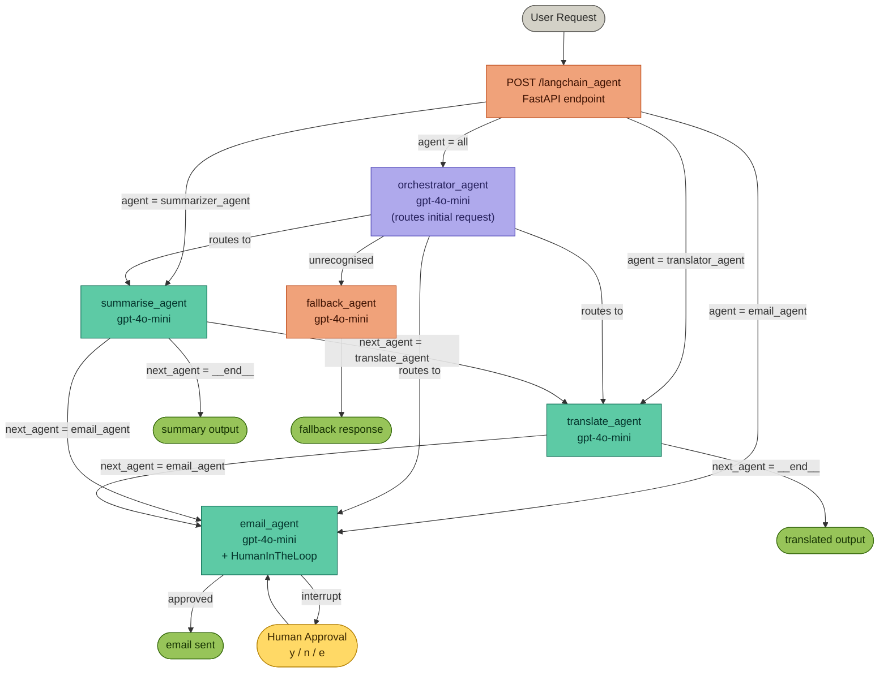

# Multi-Agent Orchestration — LangChain

A **FastAPI** service built on **LangChain** and **LangGraph** that routes natural-language requests to specialised AI agents. An orchestrator analyses each request and dispatches to the correct specialist — or chains multiple specialists together for multi-step tasks. The email agent includes a **human-in-the-loop** approval step before any email is sent.

---

## What it does

| Capability | Agent |
|---|---|
| Summarise text & extract key points | `summarise_agent` |
| Translate text into any language | `translate_agent` |
| Draft / send emails (with human approval) | `email_agent` |
| Auto-route all of the above | `orchestrator_agent` |

Single requests go to one agent. Multi-step requests (e.g. "summarise this then translate it") are chained automatically — each agent's JSON output carries a `next_agent` field that drives the next hop.

---

## Agent Graph



---

## Routing Rules

### Single-step requests

| User says | Orchestrator routes to |
|---|---|
| "Draft an email about X" | `email_agent` |
| "Summarise this text" | `summarise_agent` |
| "Translate this to French" | `translate_agent` |

### Chained requests

| User says | First agent | Chains to | Final output |
|---|---|---|---|
| "Summarise then translate to Hindi" | `summarise_agent` | `translate_agent` | translated text |
| "Translate then email the result" | `translate_agent` | `email_agent` | email sent |
| "Summarise then email the result" | `summarise_agent` | `email_agent` | email sent |

Chaining is driven by the `next_agent` field each agent returns in its JSON output.

---

## Human-in-the-Loop (Email)

Before the `email_agent` executes the `send_mail` tool, it emits an **interrupt** and waits for human approval. The API response will contain `"interrupt": true` along with the pending email details.

| Decision | Meaning |
|---|---|
| `y` | Approve — send the email as drafted |
| `n` | Reject — cancel sending |
| `e` | Edit — modify subject / body / recipient before sending |

---

## Output Schemas

| Agent | Key fields returned |
|---|---|
| `summarise_agent` | `summary`, `key_points` |
| `translate_agent` | `translated_text`, `target_language` |
| `email_agent` | `subject`, `body` |
| `orchestrator_agent` | *(delegates only — no direct output)* |

---

## API

### `POST /langchain_agent`

**Request body:**

```json
{
  "user_input": "Summarise: The internet connects billions of devices worldwide.",
  "agent": "all",
  "session_id": "default"
}
```

| Field | Type | Description |
|---|---|---|
| `user_input` | `string` | Natural-language instruction |
| `agent` | `string` | `all` \| `email_agent` \| `summarizer_agent` \| `translator_agent` |
| `session_id` | `string` | Thread ID for multi-turn sessions (default: `"default"`) |

| `agent` value | Behaviour |
|---|---|
| `all` | Orchestrator auto-routes to the right agent |
| `email_agent` | Bypasses orchestrator — calls email agent directly |
| `summarizer_agent` | Bypasses orchestrator — calls summariser directly |
| `translator_agent` | Bypasses orchestrator — calls translator directly |

**Normal response:**

```json
{
  "messages": "AI is reshaping industries worldwide.",
  "interrupt": false,
  "description": null,
  "allowed_decisions": [],
  "receiver_email": null,
  "subject": null,
  "body": null
}
```

**Interrupt response (email approval required):**

```json
{
  "messages": "Ready to send the email. Please review.",
  "interrupt": true,
  "description": "Send email via send_mail tool",
  "allowed_decisions": ["y", "n", "e"],
  "receiver_email": "someone@example.com",
  "subject": "Project Update",
  "body": "Hi, here is the latest update..."
}
```

Interactive docs available at `http://localhost:8000/docs` once the server is running.

---

## Project Structure

```
MultiAgentOrchestration/
├── main.py
├── requirements.txt
├── routes/
│   └── langchain_route.py           # FastAPI router for /langchain_agent
└── langchain_agent/
    ├── graph.py                     # LangGraph StateGraph (nodes + edges)
    ├── llm/
    │   └── llms.py                  # gpt-4o-mini initialisation
    ├── custom_agents/
    │   ├── orchestrator_agent.py    # Router — dispatches to specialists
    │   ├── summarizer_agent.py      # Text summarisation
    │   ├── translator_agent.py      # Language translation
    │   ├── email_agent.py           # Email drafting + HumanInTheLoop
    │   ├── tool_factory.py          # Transfer tools (LangGraph Command)
    │   ├── prompts/                 # System prompts per agent
    │   └── interrupt_hander/
    │       └── handle_email_interrupt.py  # y / n / e approval flow
    └── schemas/
        ├── state.py                 # MultiAgentState (messages + interrupts)
        ├── agent_schemas/           # Pydantic input/output models per agent
        └── route_schema/            # RunRequest, AgentSelector
```

---

## Setup with Conda

### 1. Clone the repo

```bash
git clone <repo-url>
cd MultiAgentOrchestration
```

### 2. Create and activate a Conda environment

```bash
conda create -n multi-agent python=3.11 -y
conda activate multi-agent
```

### 3. Install dependencies

```bash
pip install -r requirements.txt
```

### 4. Configure environment variables

Create a `.env` file in the project root:

```env
OPENAI_API_KEY=sk-...
```

### 5. Run the server

```bash
python main.py
```

Or with uvicorn directly:

```bash
uvicorn main:app --host 0.0.0.0 --port 8000 --reload
```

The API will be available at `http://localhost:8000` and interactive docs at `http://localhost:8000/docs`.

### 6. Test an agent call

```bash
curl -X POST http://localhost:8000/langchain_agent \
  -H "Content-Type: application/json" \
  -d '{"user_input": "Summarise: The internet connects billions of devices worldwide.", "agent": "all"}'
```
